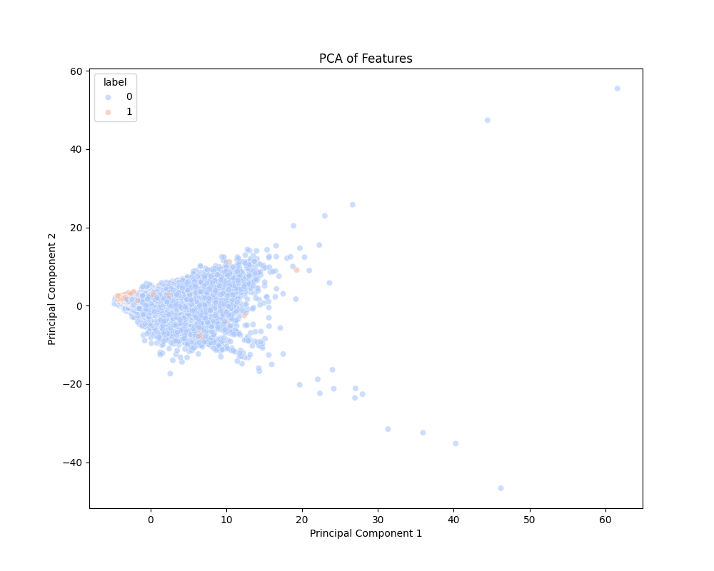

# Exploratory Data Analysis Report
## Spammer Detection System

### 1. Dataset Overview
- **Total Samples**: 458,798
- **Total Features**: 51
- **Class Distribution**:
  - Spammer: 2.69%
  - Non-Spammer: 97.31%
- **Missing Values**: 6 total missing values (only in X13 - Phone Verification)

### 2. Feature Analysis

#### 2.1 Top Important Features

The following features were identified as most important for spammer detection:
| Feature | Name | Description | Importance |
|---------|------|-------------|------------|
| X19 | UrgentInMessageCount | Count of urgent messages | 0.2261 |
| X1 | AccountAge_Seconds | Account age in seconds | 0.0761 |
| X2 | MessagesSent_Total | Total number of messages sent | 0.0680 |
| X22 | MentionsOffPlatformApp_EncodedCount | Count of off-platform app mentions | 0.0620 |
| X21 | SentLink_InMsg_Count | Count of links sent in messages | 0.0592 |

#### 2.2 Feature Categories

##### Account Behavior
- X24: UsernameHasNumbers_Flag - Username contains numbers
- X25: UsernameHasExcessiveSpecialChars_Flag - Username has excessive special characters
- X26: UsedDisposableEmail_Flag - Used a disposable email service
- X38: UsedTemporaryOnlinePhoneNumber_Flag - Used temporary phone number

##### Account Information
- X3: SellerCategory - Seller category encoded (0: New Seller, 1: Level 1, 2: Level 2, 3: Top Rated)
- X4: ReferrerType_Encoded - Type of referrer encoded
- X5: CountryTier_Encoded - Country tier encoded
- X6: CountryTier - Country risk tier (2: High Trust, 3: Medium Risk, 4: High Risk)
- X7: VerificationLevel_Encoded - Level of verification encoded
- X9: Country_Encoded - Country encoded
- X27: PaymentVerified_Flag - Payment method is verified

##### Account Metrics
- X1: AccountAge_Seconds - Account age in seconds
- X2: MessagesSent_Total - Total number of messages sent
- X8: TotalVerifiedReview - Total number of verified reviews (4-25)
- X16: MessageInDay - Number of messages sent in a day (3-18)
- X18: IncompleteOrder - Number of incomplete orders (3-13)

##### Bot Detection
- X47: IsKnownBotOrHeuristic_Flag - Detected bot-like behavior
- X48: HeadlessBrowser_Flag - Used headless browser
- X49: SuspectedRobotUser_Flag - Suspected automated account
- X50: CaptchaDefeatedByBot_Flag - Bypassed security checks

##### Message Behavior
- X11: AskedPersonalInfo - Whether user asked for personal information
- X12: LinkInMessage - Whether message contains links
- X19: UrgentInMessageCount - Count of urgent messages
- X21: SentLink_InMsg_Count - Count of links sent in messages
- X22: MentionsOffPlatformApp_EncodedCount - Count of off-platform app mentions
- X28: AsksForEmail_InMsg_Flag - Asks for email in messages
- X29: AsksForPayment_OffPlatform_Flag - Asks for payment outside platform
- X30: SentShortenedLink_InMsg_Flag - Sent shortened links in messages
- X31: AsksToOpenLink_Urgent_Flag - Urgently asks to open links
- X32: MentionsAttachment_InMsg_Count - Count of attachment mentions
- X33: UsedUrgentLanguage_InMsg_Flag - Uses urgent language in messages
- X39: VeryShortInitialMessage_Flag - Sent very short initial messages
- X40: UsedGenericSpamTemplate_Flag - Used generic spam message templates
- X42: ContactedUnsolicited_Flag - Contacted users without prior interaction
- X43: RapidMessagingDetected_Flag - Sent many messages in short time
- X45: VagueJobDescriptionPosted_Flag - Posted vague job descriptions
- X46: IndiscriminateApplicationsSent_Flag - Applied to many jobs without reading

##### Profile Features
- X10: ProfilePic_Indicator - Whether user has profile picture
- X13: PhoneVerified_Flag - Whether phone is verified
- X14: SkillsListed_Count - Number of skills listed
- X15: EmailVerified - Whether email is verified
- X17: ProfileCompletionScore - Profile completion score (1-8)

##### Security Flags
- X20: Activity_Risk_Encoded - Activity risk level encoded
- X23: FlaggedByOtherUser_Count - Count of flags by other users
- X34: ImpersonationAttempt_InMsg_Flag - Attempts impersonation in messages
- X35: AsksForFinancialDetails_OffPlatform_Flag - Requested financial information
- X36: AsksForCredentials_OffPlatform_Flag - Requested login credentials
- X37: MentionsOffPlatformPaymentMethod_Flag - Mentioned alternative payment methods
- X41: AsksForPersonalInfo_Flag - Requested personal information
- X44: AttemptedSuspiciousAction_Flag - Attempted suspicious actions

##### Other Flags
- X51: OtherBehaviorFlag_5 - Other suspicious behavior (5)

##### Composite Risk Scores
- X52: AccountRiskScore - Combined risk score based on account age, message count, rating, and risk level
- X53: MessageBehaviorRiskScore - Combined risk score based on link count, off-platform mentions, and suspicious behaviors
- X54: VerificationRiskScore - Combined risk score based on email, phone, and payment verification status

### 3. Feature Correlations

Highly correlated feature pairs (>0.8):
| Feature Pair | Description | Correlation |
|-------------|-------------|-------------|
| X35 ↔ X34 | Financial Details & Impersonation | 0.972 |
| X44 ↔ X41 | Suspicious Actions & Personal Info Requests | 0.931 |
| X20 ↔ X10 | Activity Risk & Profile Picture | 0.862 |
| X18 ↔ X16 | Incomplete Orders & Messages per Day | 0.844 |

### 4. Class Distribution Analysis

The dataset shows significant class imbalance:
- Spammer accounts: 2.69% (12,342 samples)
- Non-spammer accounts: 97.31% (446,456 samples)

### 5. Feature Distributions

#### 5.1 Account Age (X1)

- Key differences in account age distribution between spammer and non-spammer accounts
- Spammer accounts tend to be newer

#### 5.2 Message Activity (X2)

- Analysis of message sending patterns
- Higher message frequency often associated with spam activity

#### 5.3 Rating Analysis (X19)

- Most influential feature for spam detection
- Clear distinction in rating patterns between normal and spam accounts

#### 5.4 Message Risk Analysis

- Distribution of message risk scores
- Higher risk scores correlate with spam behavior

#### 5.5 Link Analysis (X22)

- Pattern of link usage in messages
- Spammer accounts show distinct link sharing behavior

### 6. Dimensional Analysis

Principal Component Analysis reveals:
- Clear separation between some spam and non-spam accounts
- Overlapping regions indicating challenging cases
- Two principal components explain 47% of variance

### 7. Missing Value Analysis

- Only X13 shows missing values (6 instances, 0.001%)
- Missing value imputation strategy: median imputation recommended

### 8. Feature Interactions

Analysis of interactions between top features shows:
- Strong relationships between behavioral metrics
- Clear clustering patterns for spam accounts
- Non-linear relationships in some feature pairs

### 9. Key Findings & Recommendations

1. **Feature Importance**:
   - Message behavior features (X19, X21, X22) are strong spam indicators
   - Account age (X1) and message count (X2) are significant factors
   - Verification features show moderate importance

2. **Risk Patterns**:
   - High urgent message counts
   - Off-platform communication attempts
   - Link sharing behavior
   - Account verification status
   - Profile completion level

3. **Recommendations**:
   - Focus on message behavior monitoring
   - Implement strict verification requirements
   - Monitor account age and activity patterns
   - Track off-platform communication attempts

4. **Class Imbalance Strategy**:
   - Implement class weights in model training
   - Consider SMOTE or other sampling techniques
   - Use stratified sampling for validation

5. **Feature Selection**:
   - Focus on top 5 features for initial modeling
   - Remove one feature from highly correlated pairs
   - Create composite features from correlated groups

6. **Model Development**:
   - Use ROC-AUC and Precision-Recall metrics
   - Implement cross-validation with stratification
   - Consider ensemble methods for robust detection

7. **Production Monitoring**:
   - Track feature importance stability
   - Monitor feature distributions for drift
   - Set up alerts for unusual patterns

---
*Report generated: 2024-03-14*
